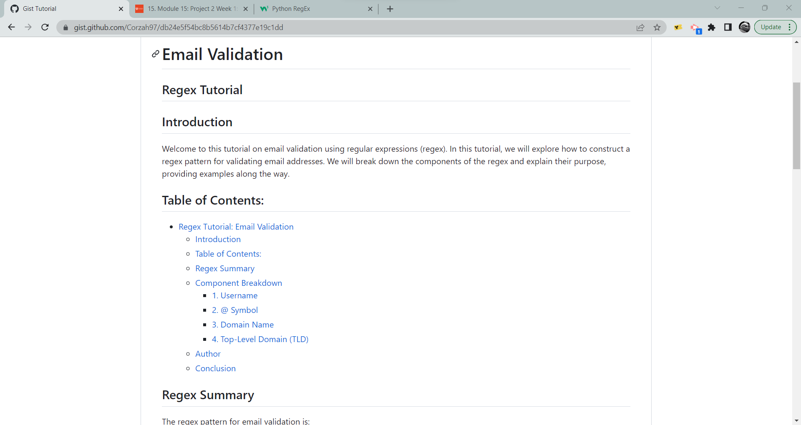
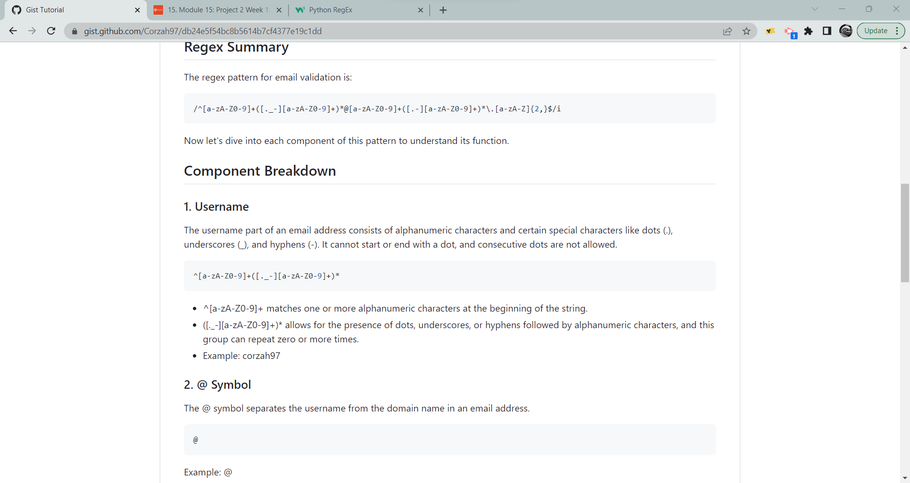
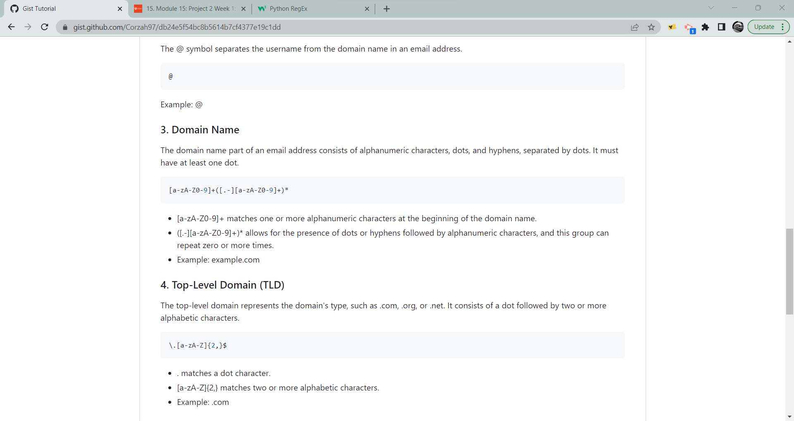

# Email Regex

  
## Description:

In this tutorial you will learn about an email regex. The turtorial breaks the regex down into it's indervidual components in order to understand the entirety of the regex's function.

[GitHub Gist](https://gist.github.com/Corzah97/db24e5f54bc8b5614b7cf4377e19c1dd)

## Table of Contents:
- [Email Regex](#email-regex)
  - [Description:](#description)
  - [Table of Contents:](#table-of-contents)
- [Overview](#overview)
  - [These Sourced were consulted in conducting research](#these-sourced-were-consulted-in-conducting-research)
  - [The Task](#the-task)
  - [The Challenge:](#the-challenge)
  - [User Story](#user-story)
  - [Acceptance Criteria](#acceptance-criteria)
  - [Screenshots.](#screenshots)
  - [Usage Instructions](#usage-instructions)
  - [Repository Link:](#repository-link)
  - [Deployed Gist Link:](#deployed-gist-link)
  - [Installation Process](#installation-process)
  - [Built With](#built-with)
  - [What I Learned](#what-i-learned)
  - [Author](#author)

# Overview

## These Sourced were consulted in conducting research

- [Fireship](https://www.youtube.com/watch?v=sXQxhojSdZM)
- [W3schools](https://www.w3schools.com/python/python_regex.asp)

## The Task

## The Challenge:
Your Challenge this week is to create a tutorial that explains how a specific regular expression, or regex, functions by breaking down each part of the expression and describing what it does. You'll use the template provided in the starter code to create your tutorial.

## User Story
```md
AS A web development student
I WANT a tutorial explaining a specific regex
SO THAT I can understand the search pattern the regex defines
```

## Acceptance Criteria
```md
GIVEN a regex tutorial
WHEN I open the tutorial
THEN I see a descriptive title and introductory paragraph explaining the purpose of the tutorial, a summary describing the regex featured in the tutorial, a table of contents linking to different sections that break down each component of the regex and explain what it does, and a section about the author with a link to the author’s GitHub profile
WHEN I click on the links in the table of contents
THEN I am taken to the corresponding sections of the tutorial
WHEN I read through each section of the tutorial
THEN I find a detailed explanation of what a specific component of the regex does
WHEN I reach the end of the tutorial
THEN I find a section about the author and a link to the author’s GitHub profile
```

## Screenshots






## Usage Instructions

1. Use the deployed GitHub Gist link.
2. Read through the Gist.
3. Navigate through the Gist using the table of contents. 


## Repository Link:
[Repository Link 'Click Here'.](https://github.com/Corzah97/Regex-Tutorial)

## Deployed Gist Link: 
[Regex GitHub Gist](https://gist.github.com/Corzah97/db24e5f54bc8b5614b7cf4377e19c1dd)


## Installation Process
1. Access the deployed public GitHub Gist [Here](https://gist.github.com/Corzah97/db24e5f54bc8b5614b7cf4377e19c1dd)

## Built With

- Visual Studio Code: [Website](https://code.visualstudio.com/)
- GitHub Gist [Website](https://gist.github.com/)

## What I Learned
1. How create a GitHub Gist
2. How to breakdown a regex into its individual functions.